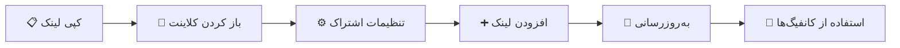
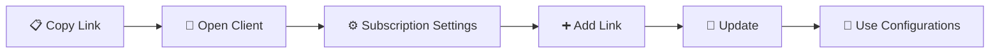

### 📋 لینک‌های اشتراک

<div align="center">

#### 🌟 اشتراک اصلی

<table>
<tr>
<td align="center">
<h4>📊 Base64 Subscription</h4>
<a href="https://raw.githubusercontent.com/PlanAsli/configs-collector-v2ray/main/sub/subscribe/base64.txt">

</a>
</td>
</tr>
</table>

#### 🔐 دسته‌بندی پروتکل

| پروتکل | لینک دانلود |
|--------|-------------|
| VLESS | [`📥 دریافت`](https://raw.githubusercontent.com/PlanAsli/configs-collector-v2ray/main/sub/protocols/vless.txt) |
| VMess | [`📥 دریافت`](https://raw.githubusercontent.com/PlanAsli/configs-collector-v2ray/main/sub/protocols/vmess.txt) |
| Trojan | [`📥 دریافت`](https://raw.githubusercontent.com/PlanAsli/configs-collector-v2ray/main/sub/protocols/trojan.txt) |
| Shadowsocks | [`📥 دریافت`](https://raw.githubusercontent.com/PlanAsli/configs-collector-v2ray/main/sub/protocols/shadowsocks.txt) |

#### 🌐 دسته‌بندی شبکه

| نوع شبکه | لینک دانلود |
|----------|-------------|
| REALITY | [`📥 دریافت`](https://raw.githubusercontent.com/PlanAsli/configs-collector-v2ray/main/sub/networks/reality.txt) |
| gRPC | [`📥 دریافت`](https://raw.githubusercontent.com/PlanAsli/configs-collector-v2ray/main/sub/networks/grpc.txt) |
| WebSocket | [`📥 دریافت`](https://raw.githubusercontent.com/PlanAsli/configs-collector-v2ray/main/sub/networks/ws.txt) |
| TCP | [`📥 دریافت`](https://raw.githubusercontent.com/PlanAsli/configs-collector-v2ray/main/sub/networks/tcp.txt) |
| HTTP/2 | [`📥 دریافت`](https://raw.githubusercontent.com/PlanAsli/configs-collector-v2ray/main/sub/networks/h2.txt) |
| HTTP Upgrade | [`📥 دریافت`](https://raw.githubusercontent.com/PlanAsli/configs-collector-v2ray/main/sub/networks/httpupgrade.txt) |
| Split HTTP | [`📥 دریافت`](https://raw.githubusercontent.com/PlanAsli/configs-collector-v2ray/main/sub/networks/splithttp.txt) |
| XHTTP | [`📥 دریافت`](https://raw.githubusercontent.com/PlanAsli/configs-collector-v2ray/main/sub/networks/xhttp.txt) |
| KCP | [`📥 دریافت`](https://raw.githubusercontent.com/PlanAsli/configs-collector-v2ray/main/sub/networks/kcp.txt) |
| Raw | [`📥 دریافت`](https://raw.githubusercontent.com/PlanAsli/configs-collector-v2ray/main/sub/networks/raw.txt) |
| HTTP | [`📥 دریافت`](https://raw.githubusercontent.com/PlanAsli/configs-collector-v2ray/main/sub/networks/http.txt) |

#### 🌍 دسته‌بندی کشورها

<details>
<summary><b>🗺️ مشاهده لیست کامل کشورها</b></summary>

| کشور | کد | لینک |
|------|----|----- |
| 🇦🇪 امارات | AE | [`📥`](https://raw.githubusercontent.com/PlanAsli/configs-collector-v2ray/main/sub/countries/AE.txt) |
| 🇦🇱 آلبانی | AL | [`📥`](https://raw.githubusercontent.com/PlanAsli/configs-collector-v2ray/main/sub/countries/AL.txt) |
| 🇦🇲 ارمنستان | AM | [`📥`](https://raw.githubusercontent.com/PlanAsli/configs-collector-v2ray/main/sub/countries/AM.txt) |
| 🇦🇷 آرژانتین | AR | [`📥`](https://raw.githubusercontent.com/PlanAsli/configs-collector-v2ray/main/sub/countries/AR.txt) |
| 🇦🇹 اتریش | AT | [`📥`](https://raw.githubusercontent.com/PlanAsli/configs-collector-v2ray/main/sub/countries/AT.txt) |
| 🇦🇺 استرالیا | AU | [`📥`](https://raw.githubusercontent.com/PlanAsli/configs-collector-v2ray/main/sub/countries/AU.txt) |
| 🇦🇿 آذربایجان | AZ | [`📥`](https://raw.githubusercontent.com/PlanAsli/configs-collector-v2ray/main/sub/countries/AZ.txt) |
| 🇧🇦 بوسنی | BA | [`📥`](https://raw.githubusercontent.com/PlanAsli/configs-collector-v2ray/main/sub/countries/BA.txt) |
| 🇧🇪 بلژیک | BE | [`📥`](https://raw.githubusercontent.com/PlanAsli/configs-collector-v2ray/main/sub/countries/BE.txt) |
| 🇧🇬 بلغارستان | BG | [`📥`](https://raw.githubusercontent.com/PlanAsli/configs-collector-v2ray/main/sub/countries/BG.txt) |
| 🇧🇭 بحرین | BH | [`📥`](https://raw.githubusercontent.com/PlanAsli/configs-collector-v2ray/main/sub/countries/BH.txt) |
| 🇧🇴 بولیوی | BO | [`📥`](https://raw.githubusercontent.com/PlanAsli/configs-collector-v2ray/main/sub/countries/BO.txt) |
| 🇧🇷 برزیل | BR | [`📥`](https://raw.githubusercontent.com/PlanAsli/configs-collector-v2ray/main/sub/countries/BR.txt) |
| 🇧🇿 بلیز | BZ | [`📥`](https://raw.githubusercontent.com/PlanAsli/configs-collector-v2ray/main/sub/countries/BZ.txt) |
| 🇨🇦 کانادا | CA | [`📥`](https://raw.githubusercontent.com/PlanAsli/configs-collector-v2ray/main/sub/countries/CA.txt) |
| 🇨🇭 سوئیس | CH | [`📥`](https://raw.githubusercontent.com/PlanAsli/configs-collector-v2ray/main/sub/countries/CH.txt) |
| 🇨🇱 شیلی | CL | [`📥`](https://raw.githubusercontent.com/PlanAsli/configs-collector-v2ray/main/sub/countries/CL.txt) |
| 🇨🇳 چین | CN | [`📥`](https://raw.githubusercontent.com/PlanAsli/configs-collector-v2ray/main/sub/countries/CN.txt) |
| 🇨🇴 کلمبیا | CO | [`📥`](https://raw.githubusercontent.com/PlanAsli/configs-collector-v2ray/main/sub/countries/CO.txt) |
| 🇨🇷 کاستاریکا | CR | [`📥`](https://raw.githubusercontent.com/PlanAsli/configs-collector-v2ray/main/sub/countries/CR.txt) |
| 🇨🇾 قبرس | CY | [`📥`](https://raw.githubusercontent.com/PlanAsli/configs-collector-v2ray/main/sub/countries/CY.txt) |
| 🇨🇿 چک | CZ | [`📥`](https://raw.githubusercontent.com/PlanAsli/configs-collector-v2ray/main/sub/countries/CZ.txt) |
| 🇩🇪 آلمان | DE | [`📥`](https://raw.githubusercontent.com/PlanAsli/configs-collector-v2ray/main/sub/countries/DE.txt) |
| 🇩🇰 دانمارک | DK | [`📥`](https://raw.githubusercontent.com/PlanAsli/configs-collector-v2ray/main/sub/countries/DK.txt) |
| 🇪🇨 اکوادور | EC | [`📥`](https://raw.githubusercontent.com/PlanAsli/configs-collector-v2ray/main/sub/countries/EC.txt) |
| 🇪🇪 استونی | EE | [`📥`](https://raw.githubusercontent.com/PlanAsli/configs-collector-v2ray/main/sub/countries/EE.txt) |
| 🇪🇸 اسپانیا | ES | [`📥`](https://raw.githubusercontent.com/PlanAsli/configs-collector-v2ray/main/sub/countries/ES.txt) |
| 🇫🇮 فنلاند | FI | [`📥`](https://raw.githubusercontent.com/PlanAsli/configs-collector-v2ray/main/sub/countries/FI.txt) |
| 🇫🇷 فرانسه | FR | [`📥`](https://raw.githubusercontent.com/PlanAsli/configs-collector-v2ray/main/sub/countries/FR.txt) |
| 🇬🇧 انگلستان | GB | [`📥`](https://raw.githubusercontent.com/PlanAsli/configs-collector-v2ray/main/sub/countries/GB.txt) |
| 🇬🇷 یونان | GR | [`📥`](https://raw.githubusercontent.com/PlanAsli/configs-collector-v2ray/main/sub/countries/GR.txt) |
| 🇬🇹 گواتمالا | GT | [`📥`](https://raw.githubusercontent.com/PlanAsli/configs-collector-v2ray/main/sub/countries/GT.txt) |
| 🇭🇰 هنگ کنگ | HK | [`📥`](https://raw.githubusercontent.com/PlanAsli/configs-collector-v2ray/main/sub/countries/HK.txt) |
| 🇭🇷 کرواسی | HR | [`📥`](https://raw.githubusercontent.com/PlanAsli/configs-collector-v2ray/main/sub/countries/HR.txt) |
| 🇭🇺 مجارستان | HU | [`📥`](https://raw.githubusercontent.com/PlanAsli/configs-collector-v2ray/main/sub/countries/HU.txt) |
| 🇮🇩 اندونزی | ID | [`📥`](https://raw.githubusercontent.com/PlanAsli/configs-collector-v2ray/main/sub/countries/ID.txt) |
| 🇮🇪 ایرلند | IE | [`📥`](https://raw.githubusercontent.com/PlanAsli/configs-collector-v2ray/main/sub/countries/IE.txt) |
| 🇮🇱 اسرائیل | IL | [`📥`](https://raw.githubusercontent.com/PlanAsli/configs-collector-v2ray/main/sub/countries/IL.txt) |
| 🇮🇳 هند | IN | [`📥`](https://raw.githubusercontent.com/PlanAsli/configs-collector-v2ray/main/sub/countries/IN.txt) |
| 🇮🇷 ایران | IR | [`📥`](https://raw.githubusercontent.com/PlanAsli/configs-collector-v2ray/main/sub/countries/IR.txt) |
| 🇮🇸 ایسلند | IS | [`📥`](https://raw.githubusercontent.com/PlanAsli/configs-collector-v2ray/main/sub/countries/IS.txt) |
| 🇮🇹 ایتالیا | IT | [`📥`](https://raw.githubusercontent.com/PlanAsli/configs-collector-v2ray/main/sub/countries/IT.txt) |
| 🇯🇴 اردن | JO | [`📥`](https://raw.githubusercontent.com/PlanAsli/configs-collector-v2ray/main/sub/countries/JO.txt) |
| 🇯🇵 ژاپن | JP | [`📥`](https://raw.githubusercontent.com/PlanAsli/configs-collector-v2ray/main/sub/countries/JP.txt) |
| 🇰🇷 کره جنوبی | KR | [`📥`](https://raw.githubusercontent.com/PlanAsli/configs-collector-v2ray/main/sub/countries/KR.txt) |
| 🇰🇿 قزاقستان | KZ | [`📥`](https://raw.githubusercontent.com/PlanAsli/configs-collector-v2ray/main/sub/countries/KZ.txt) |
| 🇱🇹 لیتوانی | LT | [`📥`](https://raw.githubusercontent.com/PlanAsli/configs-collector-v2ray/main/sub/countries/LT.txt) |
| 🇱🇺 لوکزامبورگ | LU | [`📥`](https://raw.githubusercontent.com/PlanAsli/configs-collector-v2ray/main/sub/countries/LU.txt) |
| 🇱🇻 لتونی | LV | [`📥`](https://raw.githubusercontent.com/PlanAsli/configs-collector-v2ray/main/sub/countries/LV.txt) |
| 🇲🇩 مولداوی | MD | [`📥`](https://raw.githubusercontent.com/PlanAsli/configs-collector-v2ray/main/sub/countries/MD.txt) |
| 🇲🇰 مقدونیه | MK | [`📥`](https://raw.githubusercontent.com/PlanAsli/configs-collector-v2ray/main/sub/countries/MK.txt) |
| 🇲🇳 مغولستان | MN | [`📥`](https://raw.githubusercontent.com/PlanAsli/configs-collector-v2ray/main/sub/countries/MN.txt) |
| 🇲🇴 ماکائو | MO | [`📥`](https://raw.githubusercontent.com/PlanAsli/configs-collector-v2ray/main/sub/countries/MO.txt) |
| 🇲🇹 مالت | MT | [`📥`](https://raw.githubusercontent.com/PlanAsli/configs-collector-v2ray/main/sub/countries/MT.txt) |
| 🇲🇺 موریس | MU | [`📥`](https://raw.githubusercontent.com/PlanAsli/configs-collector-v2ray/main/sub/countries/MU.txt) |
| 🇲🇽 مکزیک | MX | [`📥`](https://raw.githubusercontent.com/PlanAsli/configs-collector-v2ray/main/sub/countries/MX.txt) |
| 🇲🇾 مالزی | MY | [`📥`](https://raw.githubusercontent.com/PlanAsli/configs-collector-v2ray/main/sub/countries/MY.txt) |
| 🇳🇬 نیجریه | NG | [`📥`](https://raw.githubusercontent.com/PlanAsli/configs-collector-v2ray/main/sub/countries/NG.txt) |
| 🇳🇱 هلند | NL | [`📥`](https://raw.githubusercontent.com/PlanAsli/configs-collector-v2ray/main/sub/countries/NL.txt) |
| 🇳🇴 نروژ | NO | [`📥`](https://raw.githubusercontent.com/PlanAsli/configs-collector-v2ray/main/sub/countries/NO.txt) |
| 🇳🇿 نیوزیلند | NZ | [`📥`](https://raw.githubusercontent.com/PlanAsli/configs-collector-v2ray/main/sub/countries/NZ.txt) |
| 🇵🇦 پاناما | PA | [`📥`](https://raw.githubusercontent.com/PlanAsli/configs-collector-v2ray/main/sub/countries/PA.txt) |
| 🇵🇪 پرو | PE | [`📥`](https://raw.githubusercontent.com/PlanAsli/configs-collector-v2ray/main/sub/countries/PE.txt) |
| 🇵🇭 فیلیپین | PH | [`📥`](https://raw.githubusercontent.com/PlanAsli/configs-collector-v2ray/main/sub/countries/PH.txt) |
| 🇵🇰 پاکستان | PK | [`📥`](https://raw.githubusercontent.com/PlanAsli/configs-collector-v2ray/main/sub/countries/PK.txt) |
| 🇵🇱 لهستان | PL | [`📥`](https://raw.githubusercontent.com/PlanAsli/configs-collector-v2ray/main/sub/countries/PL.txt) |
| 🇵🇷 پورتوریکو | PR | [`📥`](https://raw.githubusercontent.com/PlanAsli/configs-collector-v2ray/main/sub/countries/PR.txt) |
| 🇵🇹 پرتغال | PT | [`📥`](https://raw.githubusercontent.com/PlanAsli/configs-collector-v2ray/main/sub/countries/PT.txt) |
| 🇵🇾 پاراگوئه | PY | [`📥`](https://raw.githubusercontent.com/PlanAsli/configs-collector-v2ray/main/sub/countries/PY.txt) |
| 🇷🇴 رومانی | RO | [`📥`](https://raw.githubusercontent.com/PlanAsli/configs-collector-v2ray/main/sub/countries/RO.txt) |
| 🇷🇸 صربستان | RS | [`📥`](https://raw.githubusercontent.com/PlanAsli/configs-collector-v2ray/main/sub/countries/RS.txt) |
| 🇷🇺 روسیه | RU | [`📥`](https://raw.githubusercontent.com/PlanAsli/configs-collector-v2ray/main/sub/countries/RU.txt) |
| 🇸🇦 عربستان | SA | [`📥`](https://raw.githubusercontent.com/PlanAsli/configs-collector-v2ray/main/sub/countries/SA.txt) |
| 🇸🇨 سیشل | SC | [`📥`](https://raw.githubusercontent.com/PlanAsli/configs-collector-v2ray/main/sub/countries/SC.txt) |
| 🇸🇪 سوئد | SE | [`📥`](https://raw.githubusercontent.com/PlanAsli/configs-collector-v2ray/main/sub/countries/SE.txt) |
| 🇸🇬 سنگاپور | SG | [`📥`](https://raw.githubusercontent.com/PlanAsli/configs-collector-v2ray/main/sub/countries/SG.txt) |
| 🇸🇮 اسلوونی | SI | [`📥`](https://raw.githubusercontent.com/PlanAsli/configs-collector-v2ray/main/sub/countries/SI.txt) |
| 🇸🇰 اسلواکی | SK | [`📥`](https://raw.githubusercontent.com/PlanAsli/configs-collector-v2ray/main/sub/countries/SK.txt) |
| 🇹🇭 تایلند | TH | [`📥`](https://raw.githubusercontent.com/PlanAsli/configs-collector-v2ray/main/sub/countries/TH.txt) |
| 🇹🇷 ترکیه | TR | [`📥`](https://raw.githubusercontent.com/PlanAsli/configs-collector-v2ray/main/sub/countries/TR.txt) |
| 🇹🇼 تایوان | TW | [`📥`](https://raw.githubusercontent.com/PlanAsli/configs-collector-v2ray/main/sub/countries/TW.txt) |
| 🇺🇦 اوکراین | UA | [`📥`](https://raw.githubusercontent.com/PlanAsli/configs-collector-v2ray/main/sub/countries/UA.txt) |
| 🇺🇸 آمریکا | US | [`📥`](https://raw.githubusercontent.com/PlanAsli/configs-collector-v2ray/main/sub/countries/US.txt) |
| 🇻🇬 جزایر ویرجین | VG | [`📥`](https://raw.githubusercontent.com/PlanAsli/configs-collector-v2ray/main/sub/countries/VG.txt) |
| 🇻🇳 ویتنام | VN | [`📥`](https://raw.githubusercontent.com/PlanAsli/configs-collector-v2ray/main/sub/countries/VN.txt) |
| 🇿🇦 آفریقای جنوبی | ZA | [`📥`](https://raw.githubusercontent.com/PlanAsli/configs-collector-v2ray/main/sub/countries/ZA.txt) |

</details>

#### 📦 اشتراک‌های ترکیبی

| نوع | لینک دانلود |
|-----|-------------|
| Mixed 1 | [`📥 دریافت`](https://raw.githubusercontent.com/PlanAsli/configs-collector-v2ray/main/sub/splitted/mixed_1.txt) |
| Mixed 2 | [`📥 دریافت`](https://raw.githubusercontent.com/PlanAsli/configs-collector-v2ray/main/sub/splitted/mixed_2.txt) |
| Mixed 3 | [`📥 دریافت`](https://raw.githubusercontent.com/PlanAsli/configs-collector-v2ray/main/sub/splitted/mixed_3.txt) |
| Mixed 4 | [`📥 دریافت`](https://raw.git# V2Ray Config Collector 🌐

<div align="center">

[](https://github.com/PlanAsli/configs-collector-v2ray/actions)
[](https://github.com/PlanAsli/configs-collector-v2ray/commits/main)
[](https://raw.githubusercontent.com/PlanAsli/configs-collector-v2ray/main/output/all_configs.txt)

**🔥 راهنمای کامل با سه زبان | Complete Guide in 3 Languages | Полное руководство на 3 языках**

[فارسی](#فارسی) | [English](#english) | [中文](#中文) | [Русский](#русский)

</div>

---

## فارسی

### 🚀 پروژه جمع‌آوری کانفیگ V2Ray

این پروژه یک سیستم هوشمند و خودکار برای جمع‌آوری، دسته‌بندی و توزیع کانفیگ‌های V2Ray از منابع مختلف اینترنت است.

### ⭐ ویژگی‌های کلیدی

<div align="center">

| 🎯 ویژگی | 📝 توضیحات |
|---------|-----------|
| 🤖 **جمع‌آوری هوشمند** | استخراج خودکار از بیش از 50 کانال تلگرام و منبع آنلاین |
| 📦 **دسته‌بندی پیشرفته** | تفکیک بر اساس پروتکل، نوع شبکه، کشور و کیفیت |
| ⚡ **به‌روزرسانی مداوم** | هر 30 دقیقه بروزرسانی می‌شود |
| 🎯 **فیلترینگ هوشمند** | حذف کانفیگ‌های تکراری و غیرفعال |

</div>  

### 📋 لینک‌های اشتراک

<div align="center">

#### 🌟 اشتراک‌های اصلی

<table>
<tr>
<td align="center">
<h4>📊 Base64 Subscription</h4>
<a href="https://raw.githubusercontent.com/PlanAsli/configs-collector-v2ray/main/output/subscribe/base64.txt">

</a>
</td>
<td align="center">
<h4>📄 Plain Text</h4>
<a href="https://raw.githubusercontent.com/PlanAsli/configs-collector-v2ray/main/output/all_configs.txt">

</a>
</td>
</tr>
</table>

#### 🔐 دسته‌بندی پروتکل

| پروتکل | لینک دانلود |
|--------|-------------|
| VLESS | [`📥 دریافت`](https://raw.githubusercontent.com/PlanAsli/configs-collector-v2ray/main/output/protocols/vless.txt) |
| VMess | [`📥 دریافت`](https://raw.githubusercontent.com/PlanAsli/configs-collector-v2ray/main/output/protocols/vmess.txt) |
| Trojan | [`📥 دریافت`](https://raw.githubusercontent.com/PlanAsli/configs-collector-v2ray/main/output/protocols/trojan.txt) |
| Shadowsocks | [`📥 دریافت`](https://raw.githubusercontent.com/PlanAsli/configs-collector-v2ray/main/output/protocols/shadowsocks.txt) |

#### 🌐 دسته‌بندی شبکه

| نوع شبکه | لینک دانلود |
|----------|-------------|
| REALITY | [`📥 دریافت`](https://raw.githubusercontent.com/PlanAsli/configs-collector-v2ray/main/output/networks/reality.txt) |
| gRPC | [`📥 دریافت`](https://raw.githubusercontent.com/PlanAsli/configs-collector-v2ray/main/output/networks/grpc.txt) |
| WebSocket | [`📥 دریافت`](https://raw.githubusercontent.com/PlanAsli/configs-collector-v2ray/main/output/networks/ws.txt) |
| TCP | [`📥 دریافت`](https://raw.githubusercontent.com/PlanAsli/configs-collector-v2ray/main/output/networks/tcp.txt) |

</div>

### 🔧 راهنمای استفاده

<div align="center">



**مراحل ساده:**
1. یکی از لینک‌های بالا را **کپی** کنید 📋
2. کلاینت V2Ray خود را باز کنید (v2rayNG, v2rayN, etc.) 📱
3. به **تنظیمات اشتراک** بروید ⚙️
4. لینک را **اضافه** کرده و **به‌روزرسانی** کنید ➕🔄
5. از کانفیگ‌های **جدید** لذت ببرید! 🎉

</div>

---

## English

### 🚀 V2Ray Configuration Collector

An intelligent, automated system for collecting, categorizing, and distributing V2Ray configurations from various internet sources.

### ⭐ Key Features

<div align="center">

| 🎯 Feature | 📝 Description |
|-----------|---------------|
| 🤖 **Smart Collection** | Automated extraction from 50+ Telegram channels and online sources |
| 📦 **Advanced Categorization** | Classification by protocol, network type, country, and quality |
| ⚡ **Continuous Updates** | Updated every 30 minutes |
| 🎯 **Smart Filtering** | Removal of duplicate and inactive configurations |

</div>  

### 📋 Subscription Links

<div align="center">

#### 🌟 Main Subscriptions

<table>
<tr>
<td align="center">
<h4>📊 Base64 Subscription</h4>
<a href="https://raw.githubusercontent.com/PlanAsli/configs-collector-v2ray/main/output/subscribe/base64.txt">

</a>
</td>
<td align="center">
<h4>📄 Plain Text</h4>
<a href="https://raw.githubusercontent.com/PlanAsli/configs-collector-v2ray/main/output/all_configs.txt">

</a>
</td>
</tr>
</table>

#### 🔐 By Protocol

| Protocol | Download Link |
|----------|---------------|
| VLESS | [`📥 Download`](https://raw.githubusercontent.com/PlanAsli/configs-collector-v2ray/main/output/protocols/vless.txt) |
| VMess | [`📥 Download`](https://raw.githubusercontent.com/PlanAsli/configs-collector-v2ray/main/output/protocols/vmess.txt) |
| Trojan | [`📥 Download`](https://raw.githubusercontent.com/PlanAsli/configs-collector-v2ray/main/output/protocols/trojan.txt) |
| Shadowsocks | [`📥 Download`](https://raw.githubusercontent.com/PlanAsli/configs-collector-v2ray/main/output/protocols/shadowsocks.txt) |

</div>

### 🔧 How to Use

<div align="center">



**Simple Steps:**
1. **Copy** one of the links above 📋
2. Open your V2Ray client (v2rayNG, v2rayN, etc.) 📱
3. Go to **subscription settings** ⚙️
4. **Add** the link and **update** ➕🔄
5. Enjoy **fresh** configurations! 🎉

</div>

---

## 中文

### 🚀 V2Ray 配置收集器

一个智能的自动化系统，用于从各种互联网源收集、分类和分发 V2Ray 配置。

### ⭐ 核心特性

<div align="center">

| 🎯 特性 | 📝 描述 |
|-------|--------|
| 🤖 **智能收集** | 从50+个Telegram频道和在线源自动提取 |
| 📦 **高级分类** | 按协议、网络类型、国家和质量分类 |
| ⚡ **持续更新** | 每30分钟更新一次 |
| 🎯 **智能过滤** | 移除重复和无效配置 |

</div>  

### 📋 订阅链接

#### 🌟 主要订阅
```
✅ 所有配置 (Base64): 
https://raw.githubusercontent.com/PlanAsli/configs-collector-v2ray/main/output/subscribe/base64.txt

📝 所有配置 (纯文本):
https://raw.githubusercontent.com/PlanAsli/configs-collector-v2ray/main/output/all_configs.txt
```

### 🔧 使用方法

1. 复制上述链接之一
2. 打开您的V2Ray客户端 (v2rayNG, v2rayN等)
3. 进入订阅设置
4. 添加链接并更新
5. 享受新鲜配置！🎉

---

## Русский

### 🚀 Коллектор конфигураций V2Ray

Интеллектуальная автоматизированная система для сбора, категоризации и распространения конфигураций V2Ray из различных интернет-источников.

### ⭐ Ключевые особенности

<div align="center">

| 🎯 Особенность | 📝 Описание |
|---------------|-------------|
| 🤖 **Умный сбор** | Автоматическое извлечение из 50+ Telegram каналов и онлайн источников |
| 📦 **Продвинутая категоризация** | Классификация по протоколу, типу сети, стране и качеству |
| ⚡ **Непрерывные обновления** | Обновляется каждые 30 минут |
| 🎯 **Умная фильтрация** | Удаление дублирующихся и неактивных конфигураций |

</div>  

### 📋 Ссылки на подписки

#### 🌟 Основные подписки
```
✅ Все конфигурации (Base64): 
https://raw.githubusercontent.com/PlanAsli/configs-collector-v2ray/main/output/subscribe/base64.txt

📝 Все конфигурации (обычный текст):
https://raw.githubusercontent.com/PlanAsli/configs-collector-v2ray/main/output/all_configs.txt
```

### 🔧 Как использовать

1. Скопируйте одну из ссылок выше
2. Откройте ваш V2Ray клиент (v2rayNG, v2rayN и т.д.)
3. Перейдите в настройки подписок
4. Добавьте ссылку и обновите
5. Наслаждайтесь свежими конфигурациями! 🎉

---

## 📊 Statistics & Activity

<div align="center">


</div>

---

## 🤝 Contributing

We welcome contributions! If you have ideas for improving the script or want to add new sources, please submit an **Issue** or **Pull Request**.

---

## ⚖️ Disclaimer

This project is created for educational and testing purposes only. Configurations are extracted from public sources with no guarantee of stability or security. Use at your own risk.

---

<div align="center">

**Made with ❤️ by [@oxnet_ir](https://t.me/oxnet_ir)**

*Star ⭐ this repository if you find it useful!*

</div>
